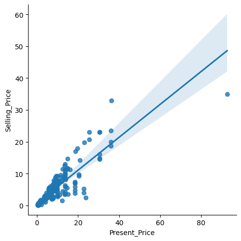
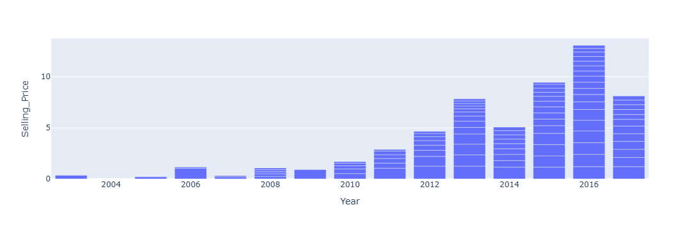

# Car Price Prediction
Car price predicting using machine learning algorithm linear Regression
# Load Data
complete Access dataset 
# Data Preprocessing
Data cleaning perform remove duplicate, null values and unwanted values, more
# Split 
split data into train and test part

# Appply Machines Learning
import sklearn for using linear regression for getting prediction

# Performace 
check prediction values 

# Data Visualisation

