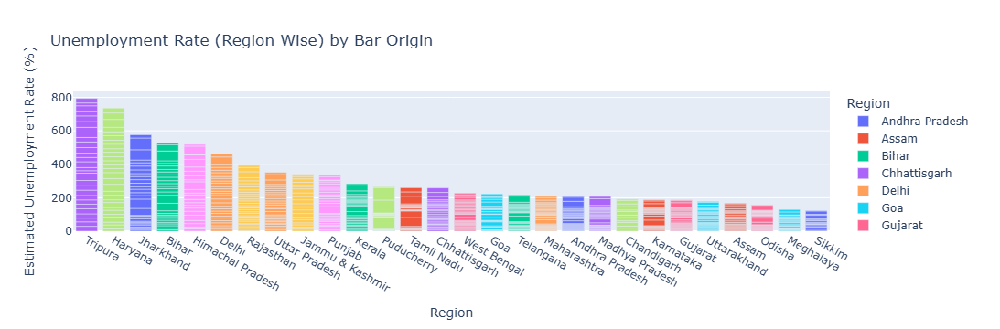
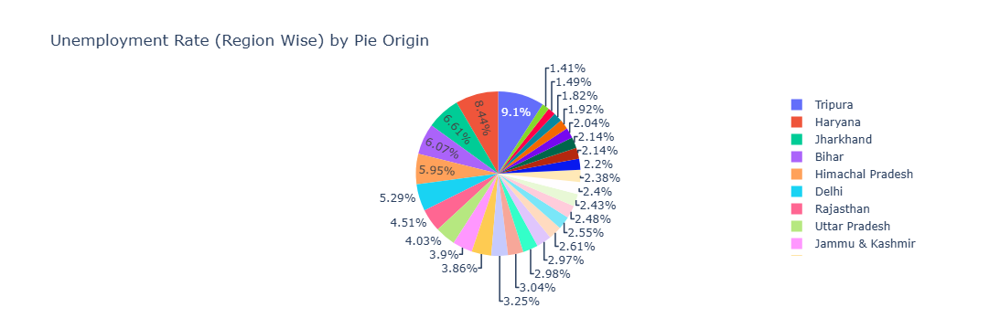
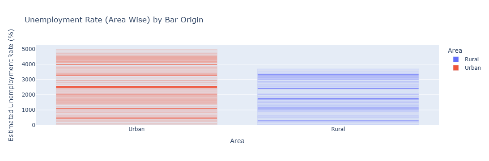

# Unemployment Analysis

To analysis dataset we use some librarie

# Libraries
<ul>
  <li>Pandas: Used to access the dataset and data manipulating</li>
  <li>Plotly: Used to represent dataset on graph format</li>
</ul>

# Analysis Steps
We taking steps to analysis 
<ul>
  <li>Access/Load Dataset</li>
  <li>Data Preprocessing</li>
  <li>Data Mining</li>
  <li>Data Analysis</li>
  <li>Represent Data on Graph</li>
</ul>

# Access/Load Dataset
To access the dataset we use pandas with read_csv() function
<ul>
  <li>head()</li>
  <li>tail()</li>
  <li>info(): </li>
  <li>describe(): </li>
</ul>

# Data Preprocessing
<ul>
  <li>Check Number of Coloums:Rows</li>
  <li>Check Null Values</li>
  <li>Remove Null Values</li>
  <li>Check Duplicate Rows</li>
  <li>Remove Duplicate Rows</li>
</ul>

# Data Analysis
store unemployment coloums on y variable

# Data Visualisation
Using library Plotly to use graph

Unemployment rate with Region Wise

Bar Graph

Pie Graph

Unemployment rate with Area Wise

Bar Graph

